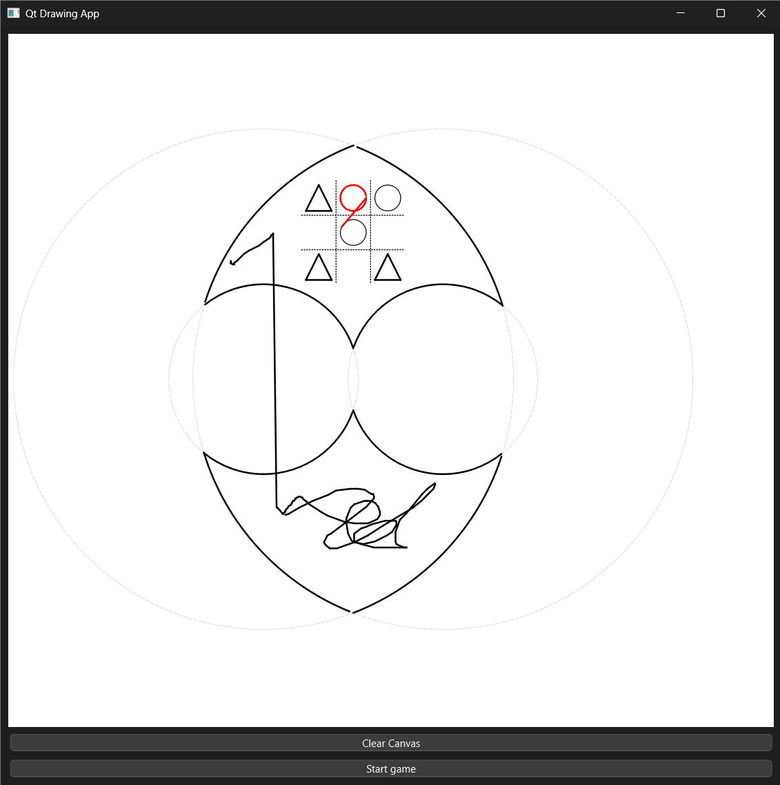

# 2DOF-Parallel-SCARA-Robot
2DOF SCARA robot also here consist of communication classes with MATLAB as TCP/IP to move robot in real time. Along with that it also consist TIK-TAK-TOE game applicarion.

This is software side of the project where user run this c++ builded .exe and also runs MATLAB controller along a side with robot connection established. 
Here use can have idea of Allowed workspace of Robot, Can move and controll robot with embedded tragectory planning with speed and step size configuration.

Apart from that, to do somthing interasting and fun a Tik_Tak-Toe Game application is also implemented.

